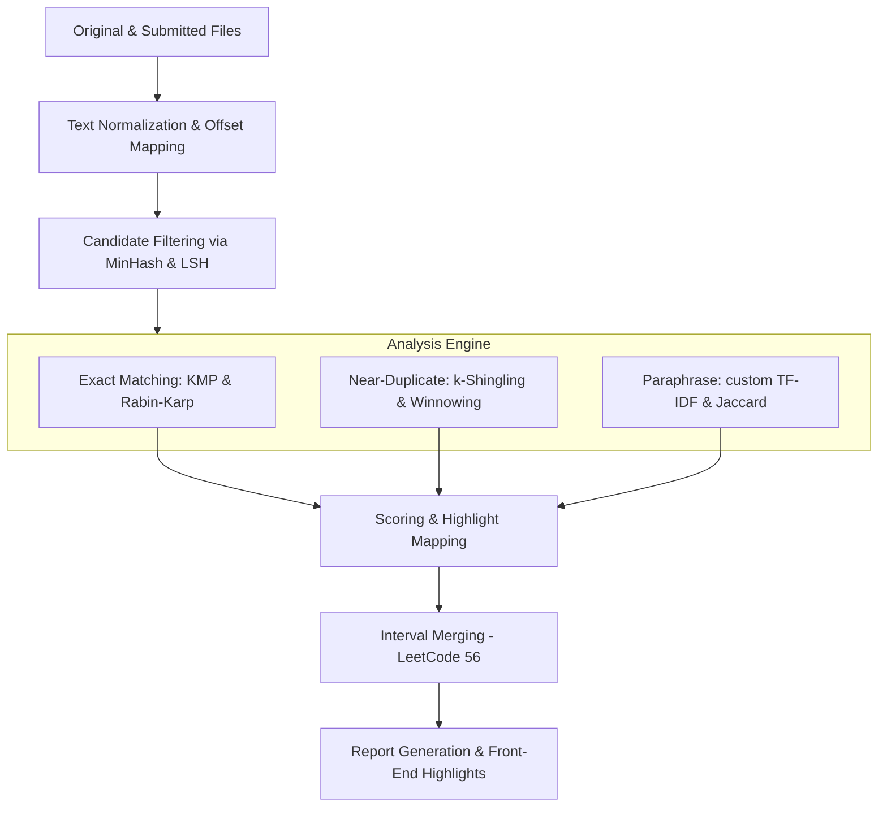

# Plagiarism Detector Using String Matching Algorithms

[](#)
[](#)
[](#)
[](#)

An industry-grade, multi-stage plagiarism detection pipeline built from first principles. It combines classic exact pattern matching, document shingling & local fingerprinting, locality sensitive hashing (LSH) for corpus-scale candidate generation, and vector space models (TF-IDF Cosine Similarity) to catch exact copies, near-duplicates, and paraphrased text.

The system features both a **Command Line Interface (CLI)** scorecard generator and an interactive **Single Page Web Dashboard** with side-by-side highlighting.

---

## 🚀 Key Features

* **Multi-Stage Detection Pipeline**: Uses a layered approach (Exact → Near-Duplicate → Paraphrase) to balance detection recall and execution speed.
* **Exact Matching (KMP & Rabin-Karp)**: Tracks exact phrase copies of length $\ge W$ characters using Knuth-Morris-Pratt and Rabin-Karp rolling hashes.
* **Local Fingerprinting (Shingling & Winnowing)**: Generates position-aware document fingerprints using $k$-word shingles and the Winnowing algorithm. Guarantees detection of matches $\ge T$ tokens even with noise, deletions, or word shuffles.
* **Fast Corpus Scaling (MinHash + LSH)**: Pre-filters reference documents by hashing token signatures into Locality Sensitive Hashing (LSH) buckets. Reduces candidate matching time from $O(N)$ to $O(1)$ expected lookup.
* **Semantic Paraphrase Checking (Custom TF-IDF)**: Implemented custom TF-IDF vectors and Cosine Similarity from scratch (no ML library dependencies) to detect synonym replacement and heavy paraphrasing.
* **Character Offset Re-Mapping**: Utilizes a custom index mapping array to map matches in the normalized string back to raw document positions. Enables precise side-by-side highlighting of plagiarized text in the browser.
* **Double-Utility Interface**: Serves as a fast CLI comparative tool or launches a premium neo-brutalist web dashboard with gauge indicators and highlight rendering.

---

## 🛠️ Folder Structure

```
Plagiarism-Detector-String-Matching/
│
├── documents/               # Reference corpus & sample submission files
│   ├── source_sorting.txt   # Reference sorting algorithms article
│   ├── source_graphs.txt    # Reference graph traversal article
│   ├── source_dp.txt        # Reference dynamic programming article
│   ├── student_honest.txt   # Clean submission example (Tree traversal)
│   ├── student_plagiarized.txt # Copied content example (Sorting & DP)
│   └── student_paraphrased.txt # Paraphrased content example (Graphs)
│
├── src/                     # Core python pipeline package
│   ├── __init__.py
│   ├── preprocess.py        # Text normalizer & index offset mapper
│   ├── exact.py             # KMP search & Rabin-Karp windowed matches
│   ├── winnow.py            # Word-level shingling & Winnowing fingerprints
│   ├── lsh.py               # Universal hash MinHasher & LSH index
│   ├── similarity.py        # Custom TF-IDF vectorizer & Jaccard index
│   ├── scoring.py           # Blended scorecard & interval merging
│   ├── app.py               # FastAPI backend web service
│   └── templates/           # UI Dashboard Assets
│       └── index.html       # Single Page Application Dashboard
│
├── outputs/                 # Locally saved comparison JSON reports
├── reports/                 # Workspace reports folder
├── docs/                    # Interview guides & project documentation
│   └── interview_prep.md    # Complete 10-Question Interview QA guide
│
├── requirements.txt         # Project libraries (FastAPI, Uvicorn, NumPy)
├── .gitignore               # Ignored system & env files
├── test_pipeline.py         # Automated unit test suite
└── main.py                  # Entrypoint: runs CLI compare or FastAPI Web UI
```

---

## ⚡ Technical Architecture

### The Plagiarism Pipeline Flow



### Data Structures & Algorithms Used

| DSA Concept | Component | Purpose |
| :--- | :--- | :--- |
| **LPS Array (Longest Prefix Suffix)** | KMP Algorithm | Skips redundant character comparisons when matching pattern snippets. |
| **Rolling Hash & Sliding Window** | Rabin-Karp Algorithm | Matches rolling substrings in $O(N+M)$ average time. |
| **Inverted Index (Hash Map)** | Winnowing & LSH | Enables instant lookup of reference document IDs matching specific hashes. |
| **Universal Hashing Family** | MinHasher | Creates compact signature arrays $h(x) = (a \cdot x + b) \pmod p$ over prime fields. |
| **Interval Merging** | Highlight Resolver | Merges overlapping highlighted character spans to prevent visual clutter. |
| **Vector Space Dot Product** | TF-IDF Cosine Similarity | Computes overall vocabulary correlation after L2 unit-normalization. |

---

## 🚀 How to Run the Project

### Prerequisites
* Python 3.8 or higher installed on your system.

### 1. Installation

Clone this repository and install the dependencies:

```bash
# Clone the repository
git clone https://github.com/yourusername/Plagiarism-Detector-String-Matching.git
cd Plagiarism-Detector-String-Matching

# Create a virtual environment
python -m venv venv
# Activate on Windows:
venv\Scripts\activate
# Activate on Mac/Linux:
source venv/bin/activate

# Install requirements
pip install -r requirements.txt
```

### 2. Running the Automated Tests

Verify that all components are running correctly by running the unit test suite:

```bash
python -m unittest test_pipeline.py
```

Expected output:
```text
........
----------------------------------------------------------------------
Ran 8 tests in 0.001s

OK
```

### 3. Using the CLI Comparison Tool

You can compare any two text files directly from your terminal:

```bash
# Compare a plagiarized submission
python main.py compare documents/student_plagiarized.txt documents/source_sorting.txt

# Compare an honest submission
python main.py compare documents/student_honest.txt documents/source_sorting.txt

# Compare a paraphrased submission
python main.py compare documents/student_paraphrased.txt documents/source_graphs.txt
```

### 4. Launching the Web Dashboard

Start the FastAPI local service:

```bash
python main.py run-server
```

Open your browser and navigate to:
👉 **[http://127.0.0.1:8000](http://127.0.0.1:8000)**

* **Step 1**: Copy and paste reference files into the **Index Reference Doc** sidebar card (or use the sample texts in the `documents/` folder).
* **Step 2**: Drag & drop or paste your submission into the **Analyze Submission** area.
* **Step 3**: Click **Run Plagiarism Check** to view the similarity percentages, metric meters, and click rows to inspect side-by-side highlighted overlap.

---

## 📊 Sample CLI Output (Virtual Simulation)

When checking the plagiarized submission vs sorting reference file:

```text
==================================================
      PLAGIARISM DETECTOR CLI SCORECARD
==================================================
Submission: student_plagiarized.txt (1191 chars)
Reference:  source_sorting.txt (1917 chars)
--------------------------------------------------
Exact Matches (Rabin-Karp Coverage):  56.2%
Fingerprint Overlap (Winnowing):     50.9%
Vocabulary Cosine (TF-IDF):          65.8%
Local Jaccard Similarity (4-gram):    25.8%
--------------------------------------------------
OVERALL SIMILARITY SCORE:            53%
STATUS:                              SEVERE MATCHING (Highly Plagiarized)
==================================================

--- SAMPLE PLAGIARIZED EVIDENCE FRAGMENTS ---
1. Offset 111-453: "Sorting is one of the most fundamental operations in computer science. It involv..."
2. Offset 486-806: "Quick Sort, developed by Tony Hoare, is a highly efficient divide-and-conquer so..."
==================================================
```

---

## 💡 Key Learning Outcomes

1. **Algorithm Implementation**: Deepened understanding of KMP and Rabin-Karp, including pre-computations (LPS array) and rolling hash functions.
2. **Robust Hashing**: Designed a universal hash family from scratch over Mersenne Prime space ($2^{61}-1$), avoiding compile errors while learning fingerprinting theory.
3. **Data Mapping**: Solved mapping-state challenges by tracking indices across text normalization, showing how clean mathematical models correspond to noisy real-world data.
4. **API & UI Integration**: Combined a Python backend with a CSS glassmorphism dashboard, showcasing full-stack capabilities suitable for modern software engineering roles.

---

## 📄 License
This project is licensed under the MIT License - see the LICENSE file for details.

---

## 👨‍💻 Author
SHRAVANI HANDE

LINKEDIN LINK : https://www.linkedin.com/in/shravani-hande-a443ab331?utm_source=share_via&utm_content=profile&utm_medium=member_android

GITHUB LINK : https://github.com/shravani120625/Plagiarism-Detector-Using-String-Matching-Algorithms.git
